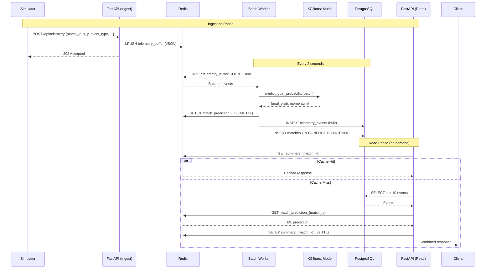

# Soccer Match Analytics Engine

High-throughput, real-time soccer match telemetry ingestion and ML inference engine. Built with FastAPI, Redis, PostgreSQL, and XGBoost.

## Architecture

```
┌─────────────────────────────────────────────────────────────────┐
│                        Load Generator                           │
│                   scripts/simulate.py (aiohttp)                 │
└─────────────────────────┬───────────────────────────────────────┘
                          │ POST /api/telemetry  (100+ req/s)
                          ▼
┌─────────────────────────────────────────────────────────────────┐
│                    FastAPI Ingestion Endpoint                    │
│               app/api/routers/ingest.py                         │
│          Deserializes → LPUSH to Redis buffer                   │
└─────────────────────────┬───────────────────────────────────────┘
                          │ LPUSH telemetry_buffer
                          ▼
┌─────────────────────────────────────────────────────────────────┐
│                     Redis Buffer (telemetry_buffer)              │
│                     Acts as a shock absorber                     │
└─────────────────────────┬───────────────────────────────────────┘
                          │ RPOP (batch of up to 1000)
                          ▼
┌─────────────────────────────────────────────────────────────────┐
│              Background Batch Worker (every 2s)                  │
│              app/workers/batch_processor.py                      │
│                                                                  │
│   ┌─────────────┐    ┌──────────────────┐    ┌───────────────┐  │
│   │ Parse JSON  │───▶│ XGBoost Inference │───▶│ Bulk Insert   │  │
│   │ batch       │    │ (goal probability) │    │ PostgreSQL    │  │
│   └─────────────┘    └────────┬─────────┘    └───────┬───────┘  │
│                               │                       │          │
│                               ▼                       ▼          │
│                        ┌──────────────┐       ┌────────────┐    │
│                        │ Redis Cache  │       │ telemetry  │    │
│                        │ predictions  │       │ _events    │    │
│                        │ (30s TTL)    │       │ table      │    │
│                        └──────────────┘       └────────────┘    │
└──────────────────────────────────────────────────────────────────┘

                          │ GET /api/matches/{id}/live-summary
                          ▼
┌─────────────────────────────────────────────────────────────────┐
│                 FastAPI Read Endpoint (Cache-Aside)              │
│               app/api/routers/matches.py                        │
│                                                                  │
│    ┌─────────┐     ┌──────────┐     ┌──────────────────┐       │
│    │ Check   │────▶│ On miss: │────▶│ Cache result in  │       │
│    │ Redis   │     │ Query    │     │ Redis (3s TTL)   │       │
│    │ cache   │     │ Postgres │     │                  │       │
│    └─────────┘     └──────────┘     └──────────────────┘       │
└──────────────────────────────────────────────────────────────────┘
```

### Data Flow — Sequence Diagram



## Tech Stack

| Component     | Technology                                      |
|---------------|-------------------------------------------------|
| API Framework | FastAPI (Uvicorn async workers)                 |
| Database      | PostgreSQL 15 (async via asyncpg/SQLAlchemy 2.0)|
| Cache/Buffer  | Redis 7 (async via redis-py)                    |
| ML Inference  | XGBoost Classifier (28 features)                |
| Migrations    | Alembic                                         |
| Validation    | Pydantic v2                                     |
| Infra         | Docker Compose                                  |

## Project Structure

```
soccer-telemetry/
├── app/
│   ├── api/routers/
│   │   ├── ingest.py        # POST /api/telemetry → Redis buffer
│   │   └── matches.py       # GET /api/matches/{id}/live-summary
│   ├── core/
│   │   ├── config.py        # pydantic-settings from .env
│   │   ├── database.py      # Async SQLAlchemy engine + session
│   │   └── redis.py         # Async Redis client singleton
│   ├── db/
│   │   └── models.py        # Match + TelemetryEvent ORM models
│   ├── ml/
│   │   ├── model.py         # MatchPredictor with real XGBoost
│   │   └── xgboost_goal_predictor.pkl  # Trained model (28 features)
│   ├── schemas/
│   │   └── telemetry.py     # TelemetryEventInput Pydantic model
│   ├── workers/
│   │   └── batch_processor.py  # Background micro-batching loop
│   └── main.py              # FastAPI app, lifespan, router mount
├── scripts/
│   └── simulate.py          # Stress-test simulator (aiohttp)
├── alembic/                 # DB migrations
├── docker-compose.yml       # Postgres 15 + Redis 7
├── requirements.txt
├── .env / .env.example
└── README.md
```

## Getting Started

### Prerequisites

- Python 3.11+
- Docker Desktop
- 1 GB free RAM

### Quick Start

```bash
# 1. Start infrastructure
docker compose up -d

# 2. Create venv and install deps
python -m venv .venv && .venv\Scripts\activate
pip install -r requirements.txt

# 3. Run database migrations
alembic upgrade head

# 4. Start the server
uvicorn app.main:app --reload

# 5. Run the stress test (15s at 100 req/s)
python scripts/simulate.py
```

Server runs at `http://localhost:8000`. Interactive docs at `/docs`.

## API Reference

### `POST /api/telemetry` — Ingest Event

Accepts a telemetry event, buffers it in Redis, returns immediately.

```json
{
  "match_id": "match_0",
  "timestamp": "2026-05-27T12:00:00Z",
  "event_type": "shot",
  "player_id": "player_7",
  "x": 92.5,
  "y": 31.2
}
```

**Response:** `202 Accepted` `{"status": "queued"}`

### `GET /api/matches/{match_id}/live-summary` — Live Match Summary

Returns the 10 most recent events + ML prediction. Cache-aside with 3s Redis TTL.

```json
{
  "match_id": "match_0",
  "recent_events": [
    {
      "id": "uuid",
      "player_id": "player_7",
      "event_type": "shot",
      "x": 92.5,
      "y": 31.2,
      "timestamp": "2026-05-27T12:00:00"
    }
  ],
  "prediction": {
    "goal_prob": 0.3241,
    "momentum": "attacking"
  }
}
```

## ML Model

The `MatchPredictor` loads an `XGBClassifier` with **28 features**:

| Feature Group   | Features                                   |
|-----------------|--------------------------------------------|
| Spatial         | `dist_to_goal`, `angle_to_goal`, `in_penalty_box` |
| Temporal        | `time_remaining`                           |
| Event Type      | 15 one-hot (Shot, Pass, Dribble, Duel, Goal Keeper, ...) |
| Play Pattern    | 9 one-hot (Regular Play, Corner, Counter, Free Kick, ...) |

Features are derived on-the-fly from raw `(x, y, event_type)` — the simulator only sends position + type, the model does the rest.

## Stress Test Results

- **1200 events** injected over 15 seconds
- **100 concurrent requests/sec**
- **0 failures** (100% 202 Accepted)
- **74 req/s** sustained throughput
- All events persisted in PostgreSQL
- XGBoost predictions stored in Redis and served via `live-summary`
