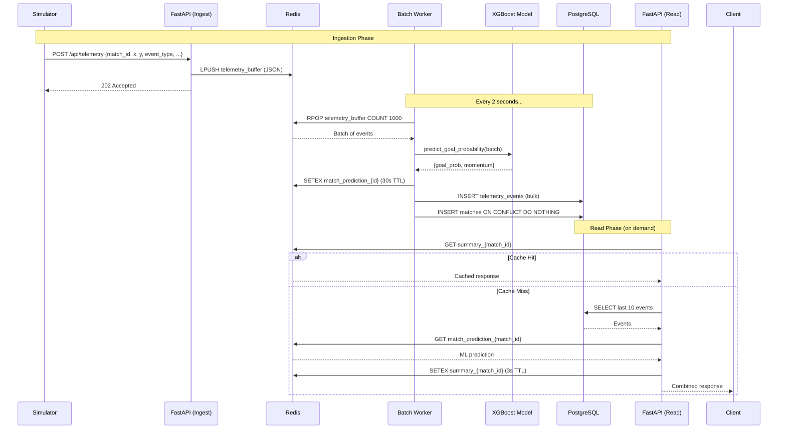

# Soccer Match Analytics Engine

High-throughput, real-time soccer match telemetry ingestion and ML inference engine. Built with FastAPI, Redis, PostgreSQL, and XGBoost.

## Architecture

```
┌─────────────────────────────────────────────────────────────────┐
│                        Load Generator                           │
│                   scripts/simulate.py (aiohttp)                 │
└─────────────────────────┬───────────────────────────────────────┘
                          │ POST /api/telemetry  (100+ req/s)
                          ▼
┌─────────────────────────────────────────────────────────────────┐
│                    FastAPI Ingestion Endpoint                    │
│               app/api/routers/ingest.py                         │
│          Deserializes → LPUSH to Redis buffer                   │
└─────────────────────────┬───────────────────────────────────────┘
                          │ LPUSH telemetry_buffer
                          ▼
┌─────────────────────────────────────────────────────────────────┐
│                     Redis Buffer (telemetry_buffer)              │
│                     Acts as a shock absorber                     │
└─────────────────────────┬───────────────────────────────────────┘
                          │ Celery beat triggers every 2s
                          ▼
┌─────────────────────────────────────────────────────────────────┐
│              Celery Worker (process_batch_task)                  │
│              app/workers/tasks.py → batch_processor.py           │
│                                                                  │
│   ┌─────────────┐    ┌──────────────────┐    ┌───────────────┐  │
│   │ RPOP batch  │───▶│ XGBoost Inference │───▶│ Bulk Insert   │  │
│   │ from Redis  │    │ (goal probability) │    │ PostgreSQL    │  │
│   └─────────────┘    └────────┬─────────┘    └───────┬───────┘  │
│                               │                       │          │
│                               ▼                       ▼          │
│                        ┌──────────────┐       ┌────────────┐    │
│                        │ Redis Cache  │       │ telemetry  │    │
│                        │ predictions  │       │ _events    │    │
│                        │ (30s TTL)    │       │ table      │    │
│                        └──────────────┘       └────────────┘    │
└──────────────────────────────────────────────────────────────────┘

                          │ GET /api/matches/{id}/live-summary
                          ▼
┌─────────────────────────────────────────────────────────────────┐
│                 FastAPI Read Endpoint (Cache-Aside)              │
│               app/api/routers/matches.py                        │
│                                                                  │
│    ┌─────────┐     ┌──────────┐     ┌──────────────────┐       │
│    │ Check   │────▶│ On miss: │────▶│ Cache result in  │       │
│    │ Redis   │     │ Query    │     │ Redis (3s TTL)   │       │
│    │ cache   │     │ Postgres │     │                  │       │
│    └─────────┘     └──────────┘     └──────────────────┘       │
└──────────────────────────────────────────────────────────────────┘
```

### Data Flow — Sequence Diagram



## Tech Stack

| Component       | Technology                                      |
|-----------------|-------------------------------------------------|
| API Framework   | FastAPI (Uvicorn async workers)                 |
| Database        | PostgreSQL 15 (async via asyncpg/SQLAlchemy 2.0)|
| Cache/Buffer    | Redis 7 (async via redis-py)                    |
| ML Inference    | XGBoost Classifier (28 features)                |
| Task Queue      | Celery (Redis broker, solo pool)                |
| Migrations      | Alembic                                         |
| Validation      | Pydantic v2                                     |
| Container       | Docker                                          |
| Orchestration   | Kubernetes (Minikube)                           |

## Project Structure

```
soccer-telemetry/
├── app/
│   ├── api/routers/
│   │   ├── ingest.py        # POST /api/telemetry → Redis buffer
│   │   └── matches.py       # GET /api/matches/{id}/live-summary
│   ├── core/
│   │   ├── celery_app.py    # Celery app + beat schedule
│   │   ├── config.py        # pydantic-settings from .env
│   │   ├── database.py      # Async SQLAlchemy engine + session
│   │   └── redis.py         # Async Redis client singleton
│   ├── db/
│   │   └── models.py        # Match + TelemetryEvent ORM models
│   ├── ml/
│   │   ├── model.py         # MatchPredictor with real XGBoost
│   │   └── xgboost_goal_predictor.pkl  # Trained model (28 features)
│   ├── schemas/
│   │   └── telemetry.py     # TelemetryEventInput Pydantic model
│   ├── workers/
│   │   ├── batch_processor.py  # Micro-batching logic
│   │   └── tasks.py         # Celery task definition
│   └── main.py              # FastAPI app, lifespan, router mount
├── scripts/
│   └── simulate.py          # Stress-test simulator (aiohttp)
├── k8s/                     # Kubernetes manifests
│   ├── postgres.yaml        # StatefulSet + PVC + Service
│   ├── redis.yaml           # Deployment + Service
│   ├── api.yaml             # FastAPI Deployment + NodePort
│   └── worker.yaml          # Celery worker Deployment
├── alembic/                 # DB migrations
├── docker-compose.yml       # Postgres 15 + Redis 7 (local dev)
├── Dockerfile               # Production container image
├── requirements.txt
├── .env / .env.example
└── README.md
```

## Getting Started

### Prerequisites

- Python 3.11+
- Docker Desktop
- 1 GB free RAM

### Local Development (Docker Compose)

```bash
# 1. Start infrastructure
docker compose up -d

# 2. Create venv and install deps
python -m venv .venv && .venv\Scripts\activate
pip install -r requirements.txt

# 3. Run database migrations
alembic upgrade head

# 4. Start the API server
uvicorn app.main:app --reload

# 5. Start the Celery worker (separate terminal)
celery -A app.core.celery_app worker -B --pool=solo --loglevel=info

# 6. Run the stress test (15s at 100 req/s)
python scripts/simulate.py
```

Server runs at `http://localhost:8000`. Interactive docs at `/docs`.

### Kubernetes Deployment (Minikube)

```bash
# 1. Start Minikube
minikube start --driver=docker

# 2. Build image into Minikube's Docker daemon
minikube image build -t soccer-backend:latest .

# 3. Deploy infrastructure
kubectl apply -f k8s/redis.yaml
kubectl apply -f k8s/postgres.yaml

# 4. Run database migrations
kubectl exec deployment/api -- alembic upgrade head

# 5. Deploy application
kubectl apply -f k8s/api.yaml
kubectl apply -f k8s/worker.yaml

# 6. Access the API
kubectl port-forward deployment/api 8000:8000

# 7. Run the stress test
python scripts/simulate.py
```

### Building the Docker Image

```bash
docker build -t soccer-backend:latest .
```

Note: When deploying to Minikube, build directly into its daemon:
```bash
minikube image build -t soccer-backend:latest .
```

## API Reference

### `POST /api/telemetry` — Ingest Event

Accepts a telemetry event, buffers it in Redis, returns immediately.

```json
{
  "match_id": "match_0",
  "timestamp": "2026-05-27T12:00:00Z",
  "event_type": "shot",
  "player_id": "player_7",
  "x": 92.5,
  "y": 31.2
}
```

**Response:** `202 Accepted` `{"status": "queued"}`

### `GET /api/matches/{match_id}/live-summary` — Live Match Summary

Returns the 10 most recent events + ML prediction. Cache-aside with 3s Redis TTL.

```json
{
  "match_id": "match_0",
  "recent_events": [
    {
      "id": "uuid",
      "player_id": "player_7",
      "event_type": "shot",
      "x": 92.5,
      "y": 31.2,
      "timestamp": "2026-05-27T12:00:00"
    }
  ],
  "prediction": {
    "goal_prob": 0.3241,
    "momentum": "attacking"
  }
}
```

## ML Model

The `MatchPredictor` loads an `XGBClassifier` with **28 features**:

| Feature Group   | Features                                   |
|-----------------|--------------------------------------------|
| Spatial         | `dist_to_goal`, `angle_to_goal`, `in_penalty_box` |
| Temporal        | `time_remaining`                           |
| Event Type      | 15 one-hot (Shot, Pass, Dribble, Duel, Goal Keeper, ...) |
| Play Pattern    | 9 one-hot (Regular Play, Corner, Counter, Free Kick, ...) |

Features are derived on-the-fly from raw `(x, y, event_type)` — the simulator only sends position + type, the model does the rest.

## Stress Test Results

### Local (Docker Compose)

| Metric | Value |
|--------|-------|
| Events injected | 1200 over 15s |
| Concurrency | 100 req/s |
| Failures | 0 (100% 202 Accepted) |
| Throughput | 74 req/s |
| Data persistence | PostgreSQL + Redis predictions |

### Kubernetes (Minikube, `--pool=solo`)

| Metric | Value |
|--------|-------|
| Events injected | 1100 over 15s |
| Concurrency | 100 req/s |
| Failures | 0 (100% 202 Accepted) |
| Throughput | 68 req/s |
| Worker batch time | 0.4–1.5s per batch |
| SIGSEGV | None (resolved by `--pool=solo`) |
